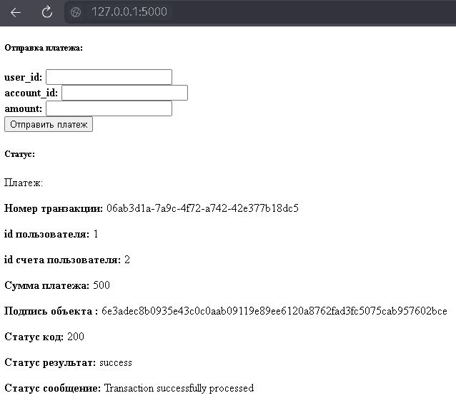

## Простейший эмулятор сторонней платежной системы:

#### Данные для ввода:

* user_id - id пользователя
* account_id - id счета пользователя
* amount - Сумма платежа

Отправляет данные следующего типа: 
```json
{
  "transaction_id": "5eae174f-7cd0-472c-bd36-35660f00132b",
  "user_id": 1,
  "account_id": 1,
  "amount": 100,
  "signature": "7b47e41efe564a062029da3367bde8844bea0fb049f894687cee5d57f2858bc8"
}
```

где:
* transaction_id - id транзакции (генерируется автоматически)
* signature - подпись объекта (генерируется автоматически)


